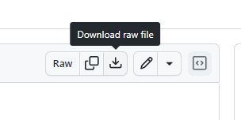
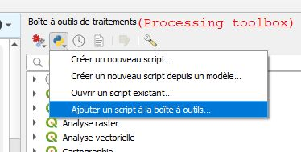

# QGIS-scripts

Random scripts that could be useful for QGIS users...

## Downloading
Look for the option "Download raw file" in the upper right corner.  

## Installing QGIS scripts 
Simply go to Processing Toolbox -> Scripts -> Add new script and select the file. (Or use "Create new script" option and copy-past the code, if the first option doesn't work.)

